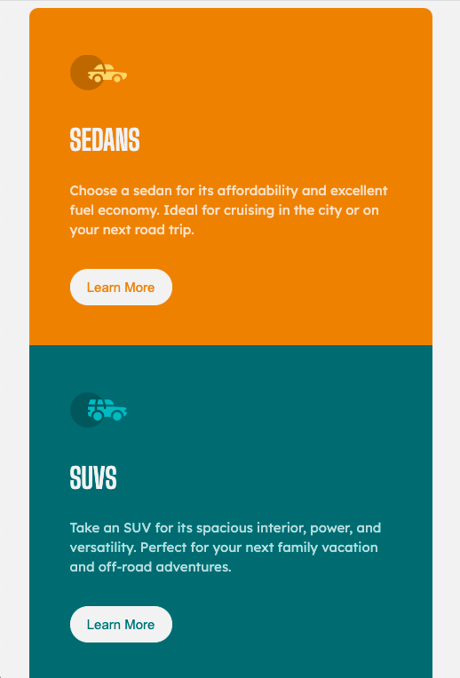
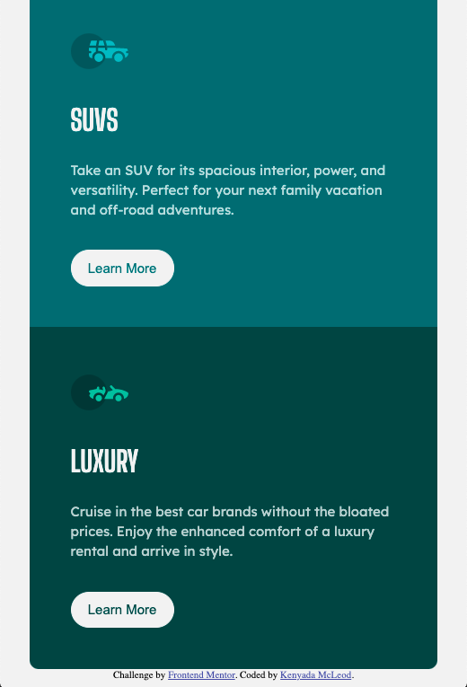
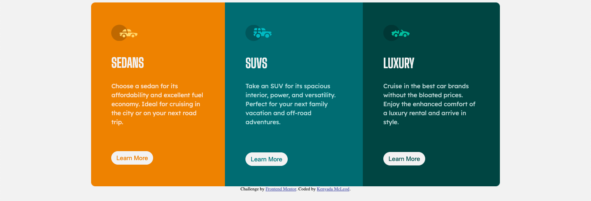

# Frontend Mentor - 3-column preview card component solution

This is a solution to the [3-column preview card component challenge on Frontend Mentor](https://www.frontendmentor.io/challenges/3column-preview-card-component-pH92eAR2-). Frontend Mentor challenges help you improve your coding skills by building realistic projects. 

## Table of contents

- [Overview](#overview)
  - [The challenge](#the-challenge)
  - [Screenshot](#screenshot)
  - [Links](#links)
- [My process](#my-process)
  - [Built with](#built-with)
  - [Continued development](#continued-development)
  - [Useful resources](#useful-resources)
- [Author](#author)
- [Acknowledgments](#acknowledgments)

**Note: Delete this note and update the table of contents based on what sections you keep.**

## Overview

### The challenge

Users should be able to:

- View the optimal layout depending on their device's screen size
  - 375px
  - 1440px
- See hover states for interactive elements

### Screenshot

### Links

- Solution URL: [Solution](https://kjm2023.github.io/fm-3-column-preview-card-component/)
- Live Site URL: [Live site](https://kjm2023.github.io/fm-3-column-preview-card-component/)

## My process

### Built with

- Semantic HTML5 markup
- CSS custom properties
- Flexbox
- Mobile-first workflow

### Continued development

Though the requirements focused on two viewports, I would like to add another so that the transition from mobile to desktop is a bit more seamless.

### Useful resources

- [Google Fonts](https://fonts.google.com) - Who doesn't love Google fonts?

## Author

- Frontend Mentor - [@kjm2023](https://www.frontendmentor.io/profile/kjm2023)

## Acknowledgments

A huge thinks to my coding friends a [GDI (Girl Develop It!)](http://girldevelopit.org). This UI Cohort is amazing!

